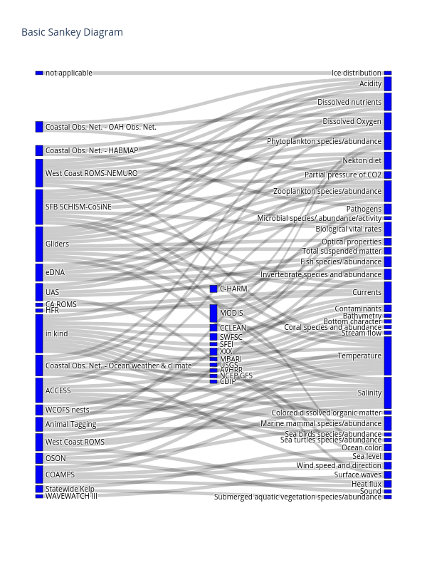

## Sankey Diagrams for Proposal ##

[Sankey diagrams](https://en.wikipedia.org/wiki/Sankey_diagram) are a way of vizualizing flow and connections between different nodes (source and target). 

For these plots I am using [Sankey Diagram](https://plotly.com/python/sankey-diagram/) module from the `plotly` library for python. These diagrams are develoepd and produced using a jupyter notebook located in the notebooks folder. 
The plots are interactive by default and can be exported as __.html__ files and copied to the webserver or saved as static __.png__ images.

### How it works ###
For each connection a source node, a target node, and a value that represents the weight of that connections must be defined and optionally, a label may also be added. This is done in `plotly` by providng a list of sources, targets, and values that defines each relationship.

### Data processing ###

The data was provided as a dictionary of with a key-value pair representing a `source:target` relationship. Because the values were provided as strings, a list of unique nodes was created and each node was assigned an integer. The integer values were then mapped to the key-value pairs. For example `'Animal Tagging'` may be mapped to the value `2`. Thus a key-vakue pair representing the connection between `"Animal Tagging":"Temperature"` would be mapped as `2:34`, where `34` represents temperature.  

It is possible to have a target of one node also be a source of another, which is illustrated in one of the example .